# Partie 1 — Découverte de l’application

## Étape 1 — Installer et lancer l’APK

La première étape consiste à installer l’application puis à observer son comportement visible avant toute analyse plus profonde.
L’objectif n’est pas encore de chercher le secret ni de lire le code, mais simplement de comprendre ce que voit un utilisateur normal.

### Action

Installer l’APK avec la commande suivante :

```bash
adb install UnCrackable-Level2.apk
```
<p align="center"> 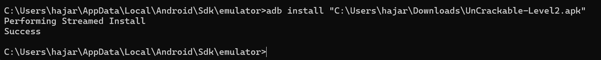 </p>

* la commande `adb install` doit retourner un message de succès :

```text
Success
```

* l’icône de l’application doit apparaître sur l’émulateur ou l’appareil
* l’application doit pouvoir être ouverte sans erreur immédiate

* Ensuite, on lance l’application sur l’émulateur:
 <p align="center"> 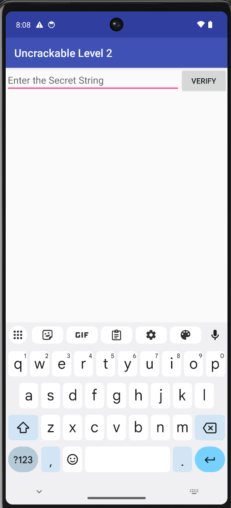 </p>


---

# Étape 2 — Tester quelques valeurs incorrectes

Avant d’ouvrir le code, il est utile de vérifier expérimentalement que l’application compare bien l’entrée utilisateur à une valeur attendue.

### Action

On essaye d'Entrer plusieurs chaînes de test dans le champ de saisie, par exemple :

```
test
1234
hello
android
```
<p align="center"> 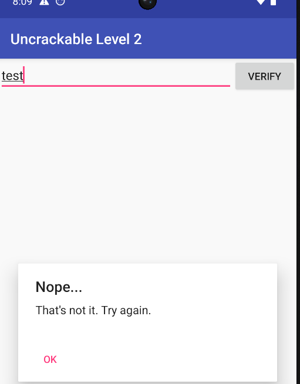 </p>
<p align="center"> 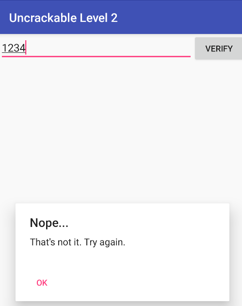 </p>

Lorsqu’une mauvaise valeur est saisie, l’application affiche un message d’erreur ou indique que la validation a échoué.

Cela montre que l’entrée de l’utilisateur est comparée à une référence interne.


# Partie 2 — Identification du point de départ de la validation

## Étape 3 — Ouvrir l’application dans un décompilateur

Après l’observation du comportement de l’application, l’étape suivante consiste à examiner sa structure interne afin de repérer l’endroit où débute réellement la logique de contrôle.
Pour cela, il est nécessaire d’ouvrir l’APK dans un outil de décompilation tel que **JADX**.

### Action

L’APK est chargé dans JADX à l’aide de la commande appropriée :

```bash
jadx-gui UnCrackable-Level2.apk
```
<p align="center"> 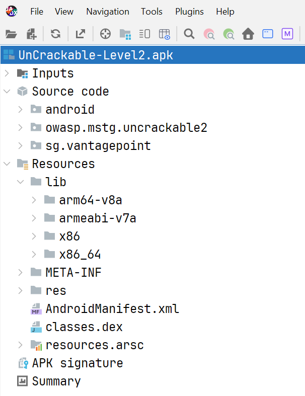 </p>
Une recherche est ensuite effectuée pour retrouver la classe **MainActivity**, qui correspond généralement à l’activité principale affichée au démarrage de l’application.

<p align="center"> 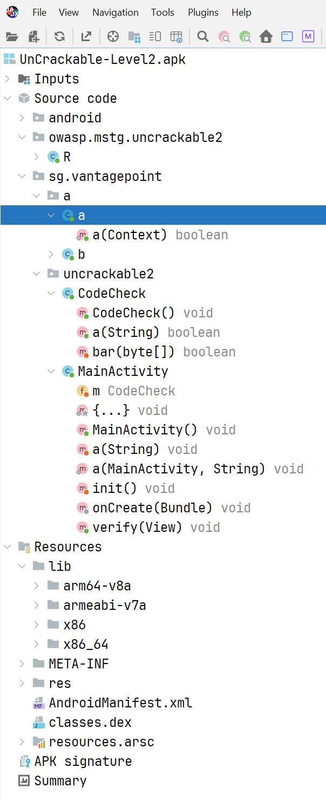 </p>

Une fois la classe localisée, son contenu peut être ouvert pour commencer l’analyse.

### Observation

L’analyse montre que **MainActivity** constitue le point d’entrée de la partie visible de l’application.

Dans ce type de challenge, la classe principale ne contient pas forcément toute la logique sensible.

Cependant, elle permet généralement de comprendre **comment la donnée utilisateur circule dans l’application**.


---

# Étape 4 — Suivre le passage de la saisie utilisateur vers la logique de contrôle

Une fois la classe principale identifiée, il faut examiner son contenu afin de comprendre comment la valeur entrée dans le champ texte est traitée au moment de la validation.

<p align="center"> 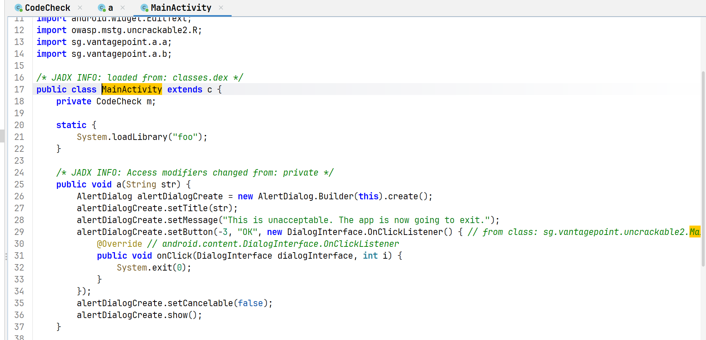 </p>

### Observation

L’examen du code de **MainActivity** montre que la chaîne entrée par l’utilisateur n’est pas vérifiée directement dans cette classe.

Au lieu de cela, elle est transmise à une méthode externe du type :

```java
m.a(userInput)
```

Cela indique que la **logique réelle de validation** se trouve dans une autre partie de l’application.

En observant qu’elle est transférée vers une autre méthode, on comprend que :

* **MainActivity agit comme intermédiaire**
* la logique de validation réelle est **déportée dans une autre classe**


# Partie 3 — Mise en évidence du rôle de la classe de vérification

## Étape 5 — Localiser la classe responsable du contrôle

Après avoir suivi le chemin de la saisie depuis **MainActivity**, l’étape suivante consiste à identifier la classe qui effectue réellement la vérification.

L’analyse montre que la méthode appelée depuis l’interface appartient à une classe nommée **CodeCheck**. Cette classe joue un rôle important, car elle agit comme un **pont entre le code Java de l’application et une bibliothèque native**.

---

<p align="center"> 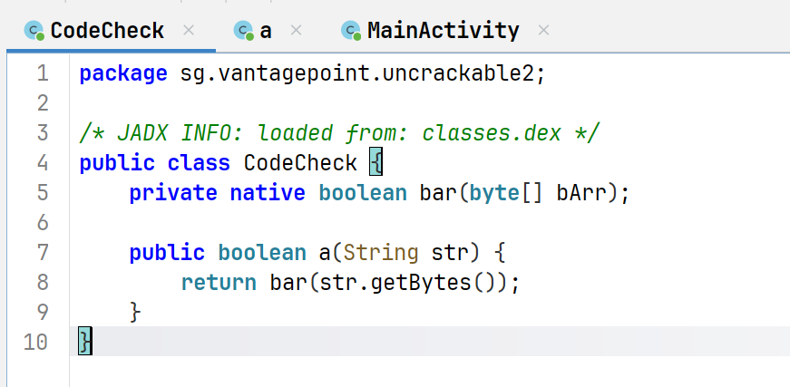 </p>
<p align="center"> 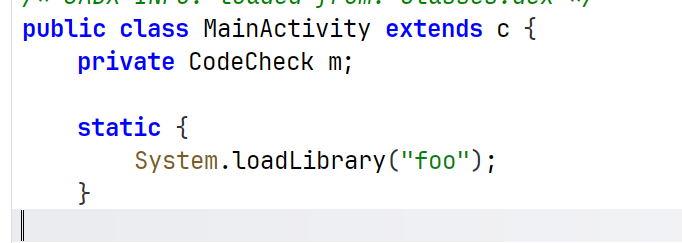 </p>

---

## Vérification

Pour confirmer que cette classe est responsable du contrôle, il faut identifier deux éléments importants dans son code :

* un chargement de bibliothèque native

```java
System.loadLibrary("foo");
```

* une méthode déclarée avec le mot-clé **native**

```java
public native boolean bar(String input);
```

La présence de ces éléments indique que **la logique complète de vérification n’est pas entièrement écrite en Java**.

---

## Observation

L’examen de la classe **CodeCheck** montre que :

* elle charge une bibliothèque native appelée **foo**
* elle délègue ensuite la vérification à une **méthode native**

Cela signifie que **la logique principale de validation n’est pas directement visible dans le code Java**.

Une partie importante du programme est donc implémentée dans du **code compilé**, généralement écrit en **C ou C++**.

---

## Explication

Le mot-clé **native** est un indicateur important en reverse engineering.

Il signifie que :

* la méthode est **déclarée en Java**
* mais son **implémentation réelle se trouve dans une bibliothèque externe**

Autrement dit, le code Java sert uniquement d’**interface vers du code natif compilé**.

Dans ce cas précis :

1. l’application appelle une méthode de **CodeCheck**
2. cette méthode appelle la fonction native **bar**
3. la fonction native effectue la **vérification réelle**

La décision finale de validation est donc probablement prise dans la bibliothèque native :

```
libfoo.so
```

---

La classe **CodeCheck** sert donc simplement de **relais entre le code Java et la bibliothèque native**.

Cela signifie que la suite de l’analyse devra se concentrer sur :

```
libfoo.so
```
car c’est très probablement dans cette bibliothèque que se trouve :

* le **secret**
* ou la **logique réelle de validation**

---


# Partie 4 — Localisation de la bibliothèque native dans l’APK

## Étape 6 — Extraire les fichiers internes de l’application

À partir du moment où l’analyse de la classe **CodeCheck** montre l’appel suivant :

```java id="vfsu2t"
System.loadLibrary("foo");
```

il devient nécessaire de vérifier **où se trouve réellement cette bibliothèque dans l’APK**.

Cette étape consiste donc à **extraire le contenu de l’application** afin d’identifier le fichier natif chargé lors de l’exécution.

---

## Action

L’APK est d’abord **décompressé** afin d’accéder aux fichiers internes qu’il contient.

<p align="center"> 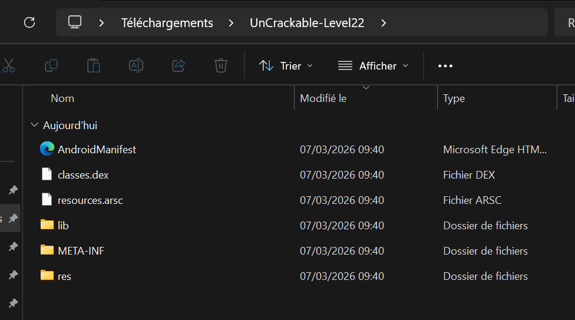 </p>

Une fois l’extraction terminée, il faut examiner le dossier :

<p align="center"> 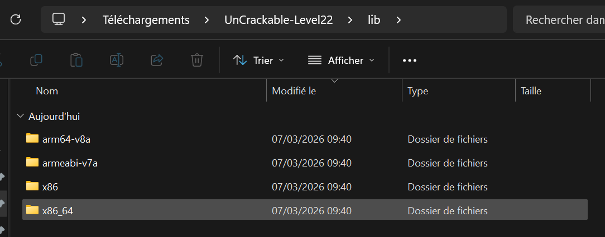 </p>

Ce dossier contient généralement les **bibliothèques natives embarquées dans l’application**.

---
<p align="center"> 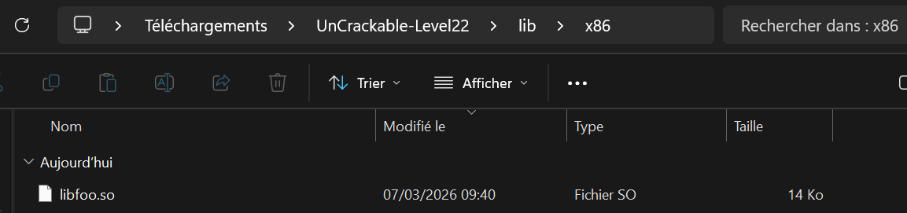 </p>

La présence du fichier suivant confirme que la bibliothèque native est bien incluse :

```id="pwe5ym"
libfoo.so
```

---

## Observation

L’exploration du dossier `lib` montre généralement plusieurs **sous-répertoires correspondant à différentes architectures processeur**.

Exemple :

```id="g9y2mn"
lib/
 ├── x86/
 │    └── libfoo.so
 ├── armeabi-v7a/
 │    └── libfoo.so
 └── arm64-v8a/
      └── libfoo.so
```

Chaque dossier contient **une version compilée de la bibliothèque native**.

Cela signifie que l’application est conçue pour fonctionner sur **plusieurs types d’appareils Android**.

---

## Explication

Sous Android, une application peut inclure **plusieurs versions d’une même bibliothèque native** afin d’être compatible avec différents processeurs.

Chaque bibliothèque est compilée pour une **architecture spécifique** :

* **x86** → émulateurs Android
* **armeabi-v7a** → appareils ARM 32 bits
* **arm64-v8a** → appareils ARM 64 bits

Lors de l’exécution, **Android choisit automatiquement la version adaptée à l’appareil utilisé**.

Dans une analyse statique, il n’est généralement **pas nécessaire d’analyser toutes les versions**.

Une seule copie suffit pour comprendre la logique interne, par exemple car on utilise un emulateur android :

```id="3pn2s0"
lib/x86/libfoo.so
```
Une fois **libfoo.so** identifiée, il devient possible d’effectuer du **reverse engineering sur le code natif**.

---

# Partie 5 — Étude de la bibliothèque native avec Ghidra

## Étape 7 — Charger la bibliothèque `libfoo.so` dans Ghidra

Une fois la bibliothèque native localisée dans le contenu extrait de l’APK, l’étape suivante consiste à l’analyser avec un outil de **reverse engineering** adapté.
Pour cela, l’utilisation de **Ghidra** permet d’examiner le binaire plus en détail et d’obtenir une représentation plus lisible de son fonctionnement interne.

<p align="center">  </p>
**Ghidra** est un framework libre d’ingénierie inverse permettant d’étudier des fichiers compilés. Il propose :

* un **désassembleur** (instructions machine)
* un **décompilateur** (pseudo-code plus lisible)

Cet outil est particulièrement utile lorsqu’une application Android utilise du **code natif**.

---

## Action

 Importer la bibliothèque identifiée précédemment :

```id="ajf82p"
libfoo.so
```

4. Lancer l’**analyse automatique** proposée par l’outil

Cette analyse permet à Ghidra de détecter :

* les **fonctions**
* les **chaînes de caractères**
* les **symboles**
* les **références internes**

<p align="center"> 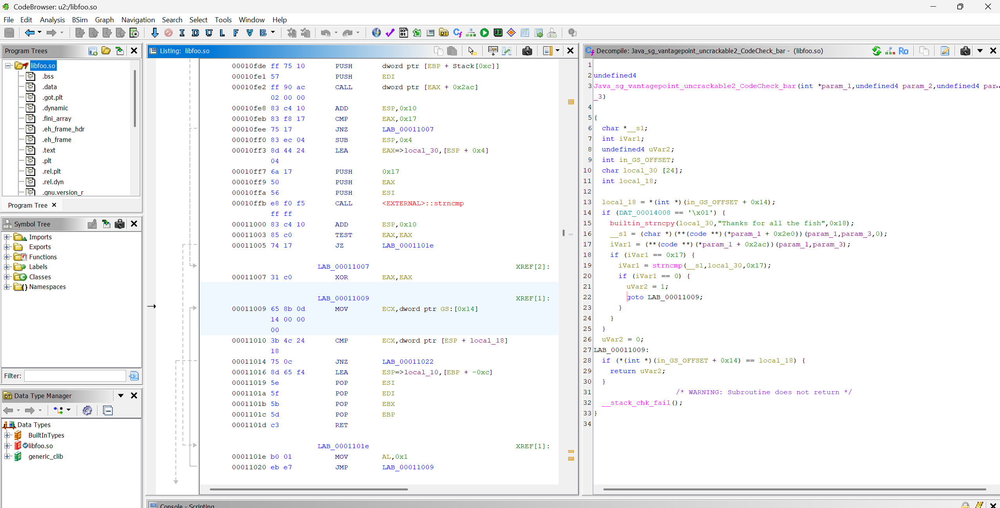 </p>
---

## Observation

Après l’analyse, Ghidra affiche la **structure générale de la bibliothèque**.

Il devient possible de :

* explorer les **fonctions détectées**
* consulter les **chaînes de caractères présentes dans le binaire**
* visualiser le **pseudo-code généré automatiquement**

---

## Explication

Contrairement au **code Java**, qui reste relativement lisible après décompilation avec **JADX**, le **code natif** provient d’une compilation bas niveau.

Cela signifie que :

* les variables sont moins explicites
* les structures sont moins visibles
* la logique peut être difficile à interpréter directement

**Ghidra aide à reconstruire une vue plus compréhensible du programme.**

Dans le cadre d’une application Android contenant des bibliothèques natives, cet outil est particulièrement utile pour **retrouver la logique réelle d’exécution**.
Une fois la bibliothèque chargée dans **Ghidra**, il devient possible d’identifier les **fonctions réellement exécutées par la méthode native observée dans CodeCheck**.


---

# Étape 8 — Retrouver la fonction native associée à `bar`

Après avoir chargé la bibliothèque dans **Ghidra**, l’objectif est maintenant d’identifier la fonction précise correspondant à la méthode native **bar** observée dans la classe **CodeCheck**.

Cette recherche repose sur les **conventions de nommage utilisées par JNI**.

---

## Action

Dans **Ghidra**, il faut rechercher un nom contenant :

```id="g77z6d"
Java_
```
<p align="center"> 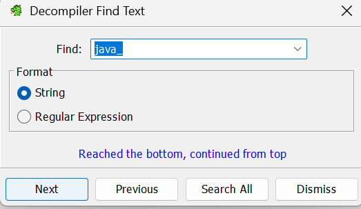 </p>

3. identifier une fonction liée à la classe **CodeCheck** et à la méthode **bar**
<p align="center"> 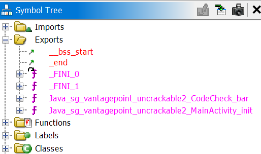 </p>
<p align="center"> 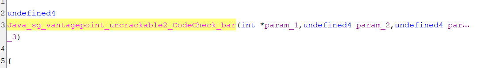 </p>
<p align="center"> 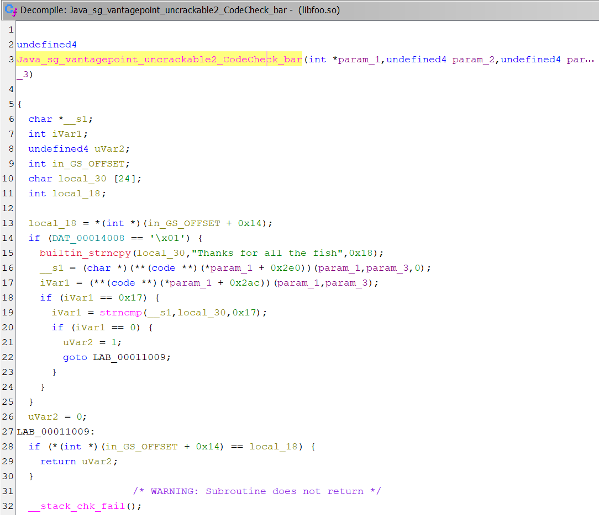 </p>

---

## Observation

L’analyse des symboles révèle une fonction suivant le format JNI :

```id="y61ru3"
Java_sg_vantagepoint_uncrackable2_CodeCheck_bar
```

Cette fonction correspond directement à **l’implémentation native de la méthode Java**.

---

## Explication

Même si ce type de nom semble complexe, la logique reste simple.

**JNI construit les noms de fonctions selon la structure suivante :**

```id="id71fp"
Java_<package>_<classe>_<méthode>
```

Cela permet à Android d’associer automatiquement :

```id="5eqwep"
méthode Java native  →  fonction présente dans la bibliothèque compilée
```

Dans ce cas :

```id="ppc5q9"
CodeCheck.bar()  →  Java_sg_vantagepoint_uncrackable2_CodeCheck_bar()
```
Cela confirme que cette fonction contient **la logique réelle de vérification**.


# Partie 6 — Analyse du mécanisme de comparaison dans le code natif

## Étape 9 — Examiner le pseudo-code de la fonction de vérification

Une fois la fonction JNI correspondant à **CodeCheck.bar** localisée dans **Ghidra**, l’étape suivante consiste à comprendre comment elle traite la saisie utilisateur.

L’objectif n’est pas de lire l’intégralité du pseudo-code en détail, mais plutôt **d’identifier l’opération utilisée pour décider si la valeur entrée est correcte ou non**.

---


Dans **Ghidra** :

<p align="center"> 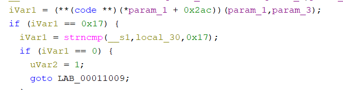 </p>

```c id="v7g1so"
strncmp()
```

Ce type de fonction est souvent utilisé pour **comparer l’entrée utilisateur avec une valeur de référence**.


indique que :

* la valeur entrée par l’utilisateur est comparée
* avec une chaîne stockée dans la bibliothèque native

---

## Observation

L’analyse du pseudo-code montre que la fonction **bar** utilise **strncmp** pour comparer l’entrée utilisateur à une chaîne de référence.

Dans certains cas, la chaîne comparée apparaît directement dans le pseudo-code.

Exemple observé :

```id="az3ruo"
Thanks for all the fish
```
<p align="center"> 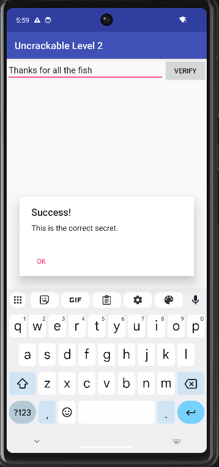 </p>
Lorsque cette chaîne apparaît **en clair**, cela signifie que **le secret attendu est déjà visible** dans le binaire.

Dans ce cas, il n’est pas nécessaire de poursuivre l’analyse pour comprendre la logique de validation.

---

## Explication

La fonction **strncmp** compare deux chaînes caractère par caractère sur une longueur donnée.

Son comportement peut être résumé ainsi :

```id="p5q3p7"
Si les deux chaînes sont identiques → résultat égal
Si elles sont différentes → résultat différent
```

Dans le contexte de l’application :

* la chaîne utilisateur est comparée
* avec une **valeur de référence stockée dans la bibliothèque**

Si les deux correspondent, la validation est considérée comme **réussie**.

Si cette chaîne est visible directement, le secret peut être identifié immédiatement.

Si cette chaîne n’apparaît pas directement dans le pseudo-code, il faut poursuivre l’analyse pour retrouver sa valeur réelle.

---

# Étape 10 — Identifier la donnée de référence utilisée dans la comparaison

Lorsque la chaîne comparée **n’apparaît pas immédiatement sous forme lisible**, il est nécessaire de suivre la donnée utilisée par **strncmp** afin de retrouver sa véritable valeur.

Cette étape consiste donc à **remonter jusqu’à la donnée stockée dans la bibliothèque native**.

---

## Action

Dans **Ghidra** :

1. Identifier les arguments transmis à **strncmp**
2. Repérer l’adresse ou la constante utilisée comme **deuxième argument**
3. Examiner cette valeur dans la mémoire ou dans les données du binaire

Exemple d’appel observé :

```c id="1v0pxt"
strncmp(user_input, reference_value, length)
```

---

## Vérification

La validation consiste à confirmer qu’une **donnée spécifique stockée dans la bibliothèque** est utilisée comme chaîne de comparaison.

Dans l’exemple étudié, la valeur apparaît sous forme **hexadécimale ASCII**.

---

## Valeur observée

La donnée extraite du binaire est :

```id="zkm6yb"
6873696620656874206c6c6120726f6620736b6e616854
```

---

## Observation

Cette valeur ne correspond pas immédiatement à une phrase lisible.

Elle est représentée comme :

```id="5o9y3k"
une suite d’octets encodés en hexadécimal
```

Cela signifie que la chaîne attendue **n’est pas affichée directement sous forme de texte clair** dans le pseudo-code.

---

## Explication

Dans une bibliothèque native, les données textuelles peuvent être stockées de différentes manières :

* chaînes de caractères visibles
* données hexadécimales
* structures en mémoire

Dans ce cas, la chaîne est stockée sous forme **hexadécimale ASCII**.

Même si elle n’est pas immédiatement lisible, elle représente toujours **une chaîne de référence utilisée pour la comparaison**.

Cette étape montre que :

```id="9zzc0u"
une donnée importante peut exister dans le binaire
même si elle n’est pas directement lisible
```

En suivant les arguments de **strncmp**, il devient possible de retrouver cette valeur et de préparer son **décodage**.

---

# Interprétation de la chaîne utilisée dans la comparaison

Lors de l’analyse de la fonction native dans Ghidra, deux situations peuvent apparaître concernant la chaîne utilisée pour la vérification :

* la chaîne est **visible directement en clair**
* la chaîne apparaît sous forme **hexadécimale**, et doit être convertie en ASCII

Dans notre analyse, **Ghidra affiche directement la chaîne finale**, ce qui simplifie l’identification du secret.

---

# Analyse de la comparaison

La ligne suivante apparaît dans le pseudo-code de la fonction native :

```c
strncmp(__s1, local_30, 0x17);
```

Cette instruction indique que :

* `__s1` correspond à **la chaîne saisie par l’utilisateur**
* `local_30` contient **la valeur de référence**
* `0x17` correspond à **la longueur de la comparaison**

La question principale devient donc :

```text
Quelle valeur est stockée dans local_30 ?
```

---

# Cas 1 — La chaîne est visible directement

Dans notre analyse avec Ghidra, la valeur apparaît clairement dans le pseudo-code :

```c
builtin_strncpy(local_30,"Thanks for all the fish",0x18);
```

Cela signifie que :

1. la variable `local_30` reçoit la chaîne `"Thanks for all the fish"`
2. la fonction `strncmp` compare l’entrée utilisateur avec cette chaîne
3. si les deux chaînes correspondent, la validation est réussie

Dans ce cas précis, **la valeur attendue est immédiatement visible** et aucune étape supplémentaire n’est nécessaire pour retrouver le secret.

---

# Cas 2 — La chaîne n’apparaît pas en clair

Dans certaines analyses, Ghidra n’affiche pas directement la chaîne.
À la place, l’analyste peut observer :

* une **adresse mémoire**
* une **constante**
* une **suite d’octets hexadécimaux**
* ou des caractères stockés individuellement

Par exemple :

```c
strncmp(__s1, PTR_DAT_00123456, 0x17);
```

Ou bien dans le code assembleur :

```
68 73 69 66 20 65 68 74 ...
```

Dans ce cas, l’analyste doit examiner ces valeurs pour déterminer si elles représentent **du texte encodé**.

---

# Pourquoi penser à une conversion ASCII ?

Plusieurs indices peuvent orienter l’analyse :

1. `strncmp` compare **des chaînes de caractères**
2. les chaînes dans un binaire sont souvent **stockées sous forme d’octets**
3. l’encodage **ASCII associe un octet à un caractère**

Par exemple :

```text
68 → h
73 → s
69 → i
66 → f
20 → espace
54 → T
```

Si une longue suite hexadécimale apparaît dans une zone utilisée par `strncmp`, il est donc logique de tester une conversion ASCII.

---

# Exemple de conversion

Supposons que l’analyste observe la valeur suivante dans le binaire :

```text
6873696620656874206c6c6120726f6620736b6e616854
```

Il la découpe en paires d’octets :

```text
68 73 69 66 20 65 68 74 20 6c 6c 61 20 72 6f 66 20 73 6b 6e 61 68 54
```

Chaque paire est ensuite convertie en caractère ASCII :

```text
h s i f   e h t   l l a   r o f   s k n a h T
```

On obtient alors :

```text
hsif eht lla rof sknahT
```

Cette chaîne apparaît comme **une phrase inversée**.
Une fois remise dans le bon sens, elle devient :

```text
Thanks for all the fish
```

---

# Conclusion pour notre analyse

Dans notre cas, cette conversion n’a pas été nécessaire.

Ghidra affiche directement la chaîne dans l’instruction suivante :

```c
builtin_strncpy(local_30,"Thanks for all the fish",0x18);
```

Cela permet d’identifier immédiatement la valeur utilisée pour la comparaison.

La chaîne attendue par l’application est donc :

```text
Thanks for all the fish
```

Si l’utilisateur saisit exactement cette valeur, la fonction `strncmp` considère la comparaison comme réussie et la validation de l’application est acceptée.


# Partie 7 — Décodage de la chaîne secrète

## Étape 11 — Conversion de la valeur hexadécimale en ASCII

Après avoir identifié dans l’analyse du code natif une valeur stockée sous forme hexadécimale, l’étape suivante consiste à la convertir afin de déterminer si elle correspond à une chaîne de caractères exploitable.

La valeur observée dans le binaire est :

```text id="7a8m0k"
6873696620656874206c6c6120726f6620736b6e616854
```

Pour effectuer cette conversion, un court script **Python** peut être utilisé.
La fonction `bytes.fromhex()` permet de transformer la suite hexadécimale en octets, puis `decode("ascii")` convertit ces octets en texte ASCII.

### Script Python
<p align="center"> 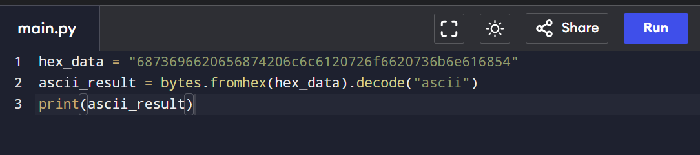 </p>

```python id="8pgc5u"
hex_value = "6873696620656874206c6c6120726f6620736b6e616854"

decoded = bytes.fromhex(hex_value).decode("ascii")

print(decoded)
```


### Résultat obtenu

L’exécution du script produit la chaîne suivante :

```text id="apg9nq"
hsif eht lla rof sknahT
```

Ce résultat confirme que la donnée contenue dans le binaire n’est pas aléatoire.
Elle correspond bien à une chaîne textuelle, même si elle n’est pas encore immédiatement lisible sous sa forme actuelle.


---

# Étape 12 — Inversion de la chaîne pour retrouver le mot de passe

L’analyse du résultat précédent montre que la chaîne ASCII obtenue semble être **écrite à l’envers**.

Il est donc nécessaire de **l’inverser** afin de retrouver la phrase attendue par l’application.

### Script Python
<p align="center"> 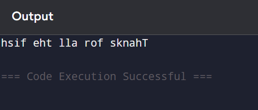 </p>
Une simple opération Python permet d’inverser une chaîne caractère par caractère :

```python id="3s1rsg"
decoded = "hsif eht lla rof sknahT"

secret = decoded[::-1]

print(secret)
```

<p align="center"> 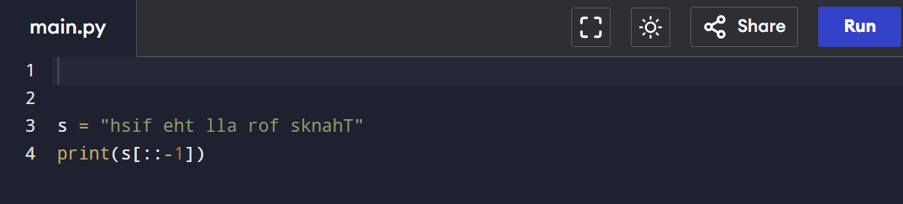 </p>


### Résultat final

L’exécution de cette instruction donne :

```text id="1h0j2g"
Thanks for all the fish
```

Cette étape montre que le secret n’était pas protégé par un mécanisme complexe.
La chaîne était simplement :

1. stockée en **hexadécimal**
2. puis **écrite à l’envers**

Une fois ces deux transformations annulées, la valeur correcte apparaît clairement.

---


